# 2025: 10 Top-Tier Clean Beauty Frozen Facial Tools You Must Know

Finding skincare that actually works without pronounceable ingredient lists requiring a chemistry degree feels impossible—you're stuck choosing between effective synthetic formulas that might harm your skin long-term or natural products that smell amazing but do absolutely nothing. Clean beauty brands have finally cracked the code by combining plant-powered ingredients with innovative delivery methods like cryotherapy, proving you don't need to sacrifice results for safety. Modern frozen facial treatments merge the anti-inflammatory benefits of ice therapy with superfood ingredients that penetrate deeper when applied cold, delivering professional spa results from your freezer.

Whether you battle puffy morning skin, stubborn dark spots, or just want that coveted dewy glow without chemical peels, these platforms revolutionize at-home skincare through simple yet effective frozen treatments. The best brands emphasize transparency with full ingredient disclosure, sustainable packaging, and formulas free from the 2,700+ questionable chemicals still legal in conventional beauty products. Users report visible improvements in skin texture, reduced inflammation, and that fresh-from-the-spa radiance within weeks of incorporating frozen facial tools into daily routines.

## **[Love & Pebble](https://loveandpebble.com)**

Revolutionary frozen superfood face masks combining cryotherapy with clean plant-based ingredients for instant glow.

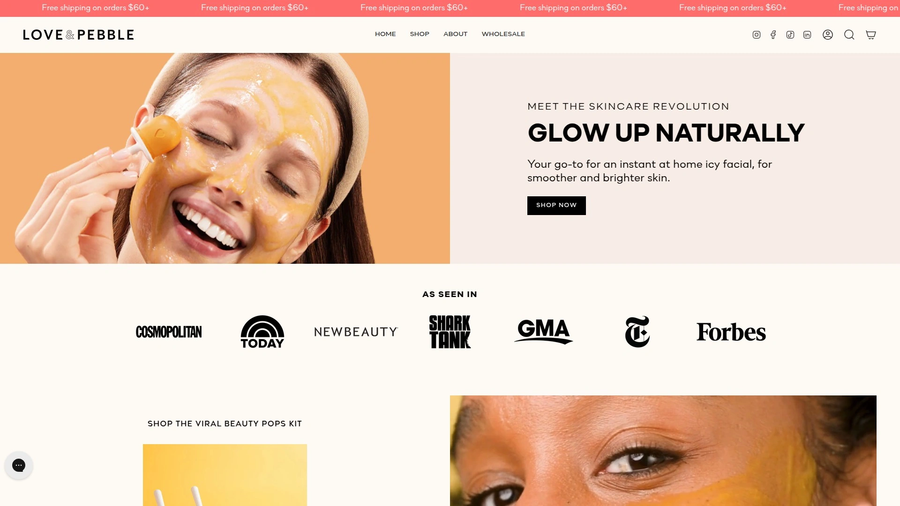

Love & Pebble disrupted traditional skincare by creating Beauty Pops—the world's first frozen face mask that functions like an ice roller but delivers actual skincare benefits through natural superfoods. The viral TikTok sensation transforms flat-lay product photos into professional experiences where you mix powder with water, freeze in included molds, then glide the frozen pops across your skin like traditional masks but with added ice therapy advantages.

**Superfood ingredient powerhouse:** Banana extract rich in vitamins A, B, and E moisturizes and softens skin while delivering essential nutrients. Turmeric provides anti-inflammatory and brightening properties that fade dark spots and even skin tone. Papaya extract acts as natural exfoliant promoting skin cell renewal for glowing complexions. Aloe vera soothes irritation, heals blemishes, and fights acne with gentle effectiveness.

The Glow Enzyme kit includes everything needed for 10-12 treatments—reusable Beauty Pops tray, mixing spatula, measuring spoon, and powdered mask formula. Mix the powder with water into paste consistency, pour into molds, freeze 3-4 hours, then rub frozen pops all over skin enjoying simultaneous benefits from superfood ingredients and ice therapy. This innovative delivery method eliminates traditional mask messiness while providing cooling relief that tightens pores, reduces inflammation, and promotes blood circulation.

**Measurable skin benefits verified by users:** Eliminates puffiness instantly through cold therapy constricting blood vessels. Brightens dark spots with turmeric and papaya working synergistically. Refines pores through tightening effect of ice combined with gentle exfoliation. Reduces redness, swelling, and inflammation making it perfect for sensitive or acne-prone skin. Heals blemishes while fighting future breakouts through aloe vera's antibacterial properties.

Knowledge backed by pharmacy co-founder ensures formulations use most gentle yet effective ingredients inspired by Asian heritage skincare wisdom. The brand takes guesswork out of ingredients so you truly focus on self-care rather than worrying whether products harm your skin. Plant-powered skincare philosophy means every ingredient nourishes skin without synthetic additives, parabens, sulfates, or phthalates.

Customer testimonials validate results: "I've noticed a huge difference in my skin. My acne cleared so fast and it gives my face such a nice glow! The ingredients are so clean and easy to know what's going on my face". Another user reports: "I love trying new skincare products and this did not disappoint. The popsicles are like using an ice globe but with actual benefits. My skin was so glowy, my texture was reduced, and it gave my skin a nice bounce to it".

For skincare enthusiasts wanting innovative frozen facial treatments that combine proven ice therapy with superfood nutrition through mess-free application, Love & Pebble's Beauty Pops deliver professional results without leaving your home.

## **[Skin Gym](https://www.skingymco.com)**

Professional cryo tools and ice rollers bringing spa-quality facial treatments to daily routines.

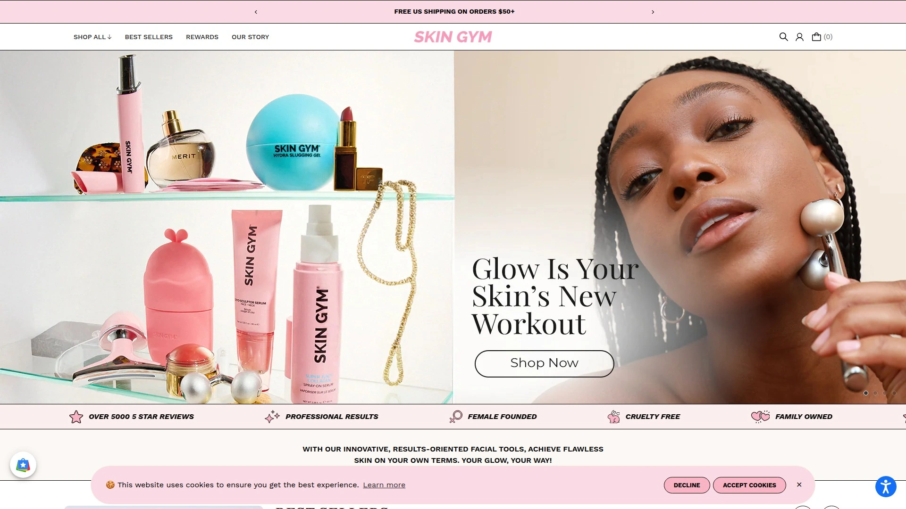

Skin Gym specializes in reusable cryotherapy tools designed for home use with professional-grade quality. The CryoRoll Ice Roller harnesses rejuvenating power of ice through innovative design allowing quick easy ice massage enhancing skin's natural radiance. Unlike disposable alternatives, Skin Gym's eco-conscious reusable silicone construction provides durable long-term skincare investments.

Simply fill CryoRoll with water and freeze for your next treatment. Glide the icy cold roller across clean face and neck when you wake up or anytime you need quick skin refresh. The tool reduces appearance of puffiness leaving refreshed energized complexion. Cryotherapy soothes irritation and redness promoting calmer brighter skin tone. Preps skin for smooth application of subsequent skincare and makeup ensuring flawless finish.

**Versatile full-body applications:** CryoRoll works beyond facial skin—use on neck, shoulders, and legs for complete body rejuvenation experience. Pro tip enhances treatments by adding essential oil drops or soothing ingredients like aloe or cucumber to water before freezing for enhanced spa-at-home aromatherapy. This customization lets you tailor each treatment to current skin needs and personal preferences.

Cryo-Ice Massage Sticks provide targeted treatment for specific facial areas requiring extra attention. These handheld tools deliver concentrated cold therapy perfect for under-eye puffiness, temples during headaches, or spot-treating inflamed blemishes. The mess-free convenient design integrates powerful cryotherapy into everyday skincare routines without complicated preparation.

Skin Gym products appear regularly on beauty award lists and professional recommendations for delivering genuine results rather than gimmicky gadgets. The brand emphasizes wake-up de-puffing protocols where quick morning roll instantly revives tired complexions before facing the day. For beauty enthusiasts seeking professional-quality cryo tools without spa pricing, Skin Gym's reusable designs provide long-term value.

## **[BeautyBio](https://beautybio.com)**

Professional-grade stainless steel cryo rollers combining luxury design with clinical effectiveness.

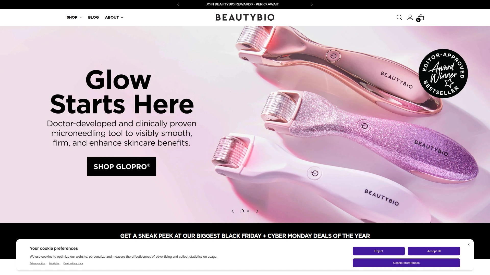

BeautyBio's Cryo Skin Icing Roller represents premium end of frozen facial tools with dual-ended professional-grade stainless steel construction. The 100% solid stainless steel barrels maintain cold temperatures significantly longer than plastic alternatives, holding onto cold and delivering sustained even cold therapy throughout treatments. Perfect weighting provides all necessary pressure without requiring excessive force during rolling.

**Advanced therapeutic benefits:** Professional-grade rollers depuff, tighten, and detoxify skin for clearer more sculpted radiant appearance. The cold temperatures instantly constrict blood vessels reducing visible redness and inflammation. Lymphatic drainage facilitated by proper rolling technique moves accumulated fluids away from face eliminating morning puffiness caused by late-night snacking or alcohol consumption.

Store rollers in freezer letting them acclimate about 5 minutes before applying to skin—this prevents uncomfortable shock while maintaining therapeutic cold. Dual-ended design provides larger roller for cheeks, forehead, and broader facial areas plus smaller roller specifically shaped for delicate eye area and facial contours. The GloPRO Cryo Roller Duo attachment expands functionality for users already invested in BeautyBio's microneedling ecosystem.

BeautyBio positions itself as at-home alternative to expensive cryofacial treatments offered at luxury spas charging $200-500 per session. Investment in professional-grade tools pays for itself after just few uses compared to ongoing spa appointments. The stainless steel construction ensures lifelong durability—these aren't disposable beauty gadgets requiring regular replacement.

Beauty editors consistently rank BeautyBio among best overall ice rollers testing multiple products across weeks integrating them into daily skincare routines. Testers report decreased puffiness after each use with most impressive results appearing over long-term—after four weeks users noticed increased definition along jaw and cheekbones suggesting actual structural improvements beyond temporary de-puffing. For skincare devotees willing to invest in premium tools delivering lasting results, BeautyBio's stainless steel rollers justify higher price points.

## **[Drunk Elephant](https://www.drunkelephant.com)**

Biocompatible clean skincare focusing on skin barrier repair without suspicious fillers.

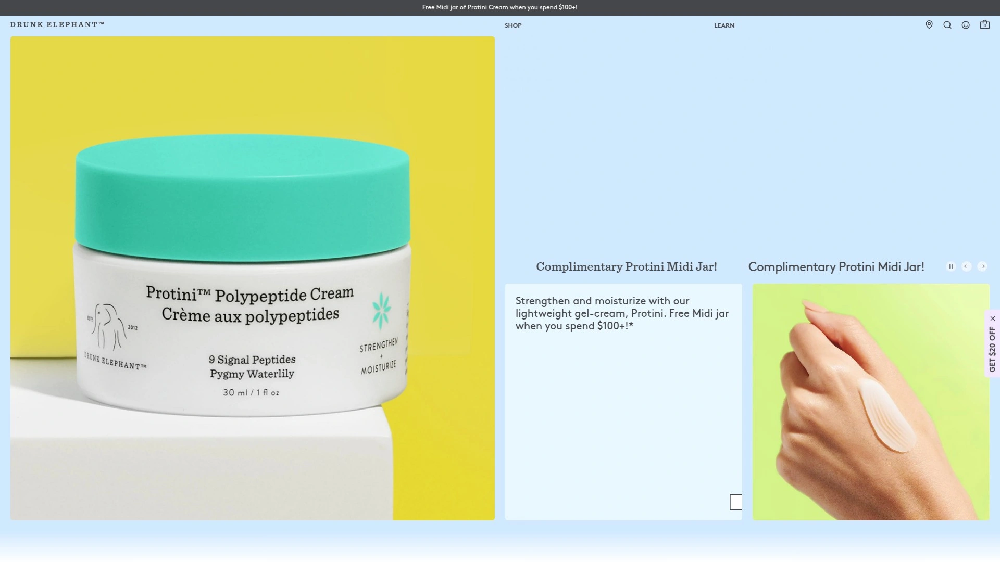

Drunk Elephant built its reputation on philosophy that skin deserves only ingredients either directly benefiting health or supporting formula integrity—nothing else. The brand avoids essential oils, drying alcohols, silicones, chemical sunscreens, fragrances, dyes, and sulfates creating formulas good for skin and environment simultaneously. This elimination approach differs from brands adding beneficial ingredients while retaining problematic ones.

Protini Polypeptide Cream exemplifies their biocompatible approach—apply small amount to face and neck after cleansing morning and night for firmer smoother skin. The peptide-rich formula repairs skin barrier damage accumulated from harsh products, environmental stressors, and aging. Unlike moisturizers relying on occlusives simply trapping moisture, Protini actually strengthens skin's ability to retain hydration independently.

**Clean ingredient philosophy in practice:** Drunk Elephant scrutinizes every ingredient asking whether it directly benefits skin health or merely exists as cheap filler. Inactive ingredients and unnecessary additives get eliminated ensuring maximum concentration of active beneficial components. This results in potent formulas requiring smaller application amounts than conventional products diluted with fillers.

The brand's transparency extends beyond ingredient lists into comprehensive education about why specific ingredients were chosen and how they interact with skin biochemistry. This educational approach empowers consumers to make informed decisions rather than relying on marketing hype. Drunk Elephant avoids "clean beauty" greenwashing where brands claim natural status while still including questionable synthetic preservatives.

Drunk Elephant enjoys cult following among clean skincare enthusiasts evidenced by consistently strong sales and social media presence. The brand proves effective skincare doesn't require compromising on ingredient safety or environmental impact. For consumers prioritizing skin barrier health through biocompatible formulations, Drunk Elephant's science-backed approach delivers measurable improvements.

## **[Youth To The People](https://www.youthtothepeople.com)**

Superfood-powered vegan skincare merging nutrition science with clean beauty principles.

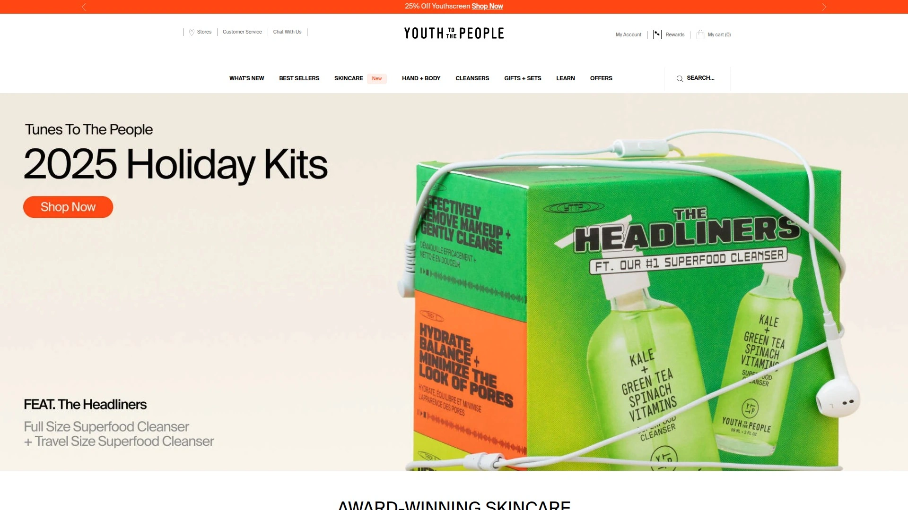

Youth To The People merges superfoods with skincare science creating healthy skin through nutritional approach. The brand philosophy treats skin like you would your body—nourish it with vitamins, antioxidants, and phytonutrients for optimal function. All products maintain vegan, cruelty-free status using plant-derived ingredients without animal testing or animal-derived components.

Superfood Antioxidant Cleanser represents their flagship product—massage 1-2 pumps into damp skin and rinse with warm water to cleanse and refresh. The formula contains kale, spinach, and green tea providing concentrated antioxidant protection while gently removing impurities. Unlike harsh cleansers stripping skin of natural oils, this superfood blend maintains moisture balance during cleansing.

**Complete superfood ecosystem:** Superfood Air-Whip Moisturizer delivers lightweight hydration using hyaluronic acid combined with superfood extracts. Superfruit Gentle Exfoliating Cleanser incorporates vitamin C and papaya for chemical exfoliation without abrasive scrubs. Supershroom Calm Cleanser features adaptogens, snow mushroom, oat oil lipids, and vitamins for sensitive reactive skin. Superfood Skin Drip Serum combines peptides and niacinamide smoothing skin while boosting glow.

Youth To The People maintains transparent ingredient sourcing and manufacturing practices. The brand educates consumers about superfood benefits for skin helping people understand why specific ingredients were selected. This transparency builds trust in increasingly skeptical beauty market where greenwashing runs rampant.

Beauty enthusiasts with dry skin particularly appreciate Youth To The People formulations balancing effective treatment with gentle nourishment. The brand appears frequently on clean beauty recommendation lists alongside more expensive luxury options proving effective clean skincare doesn't always require premium pricing. For plant-based skincare devotees wanting nutritional approach to beauty, Youth To The People's superfood philosophy delivers visible results.

## **[Herbivore Botanicals](https://www.herbivorebotanicals.com)**

Natural botanical skincare emphasizing gentle plant-based ingredients in sustainable packaging.

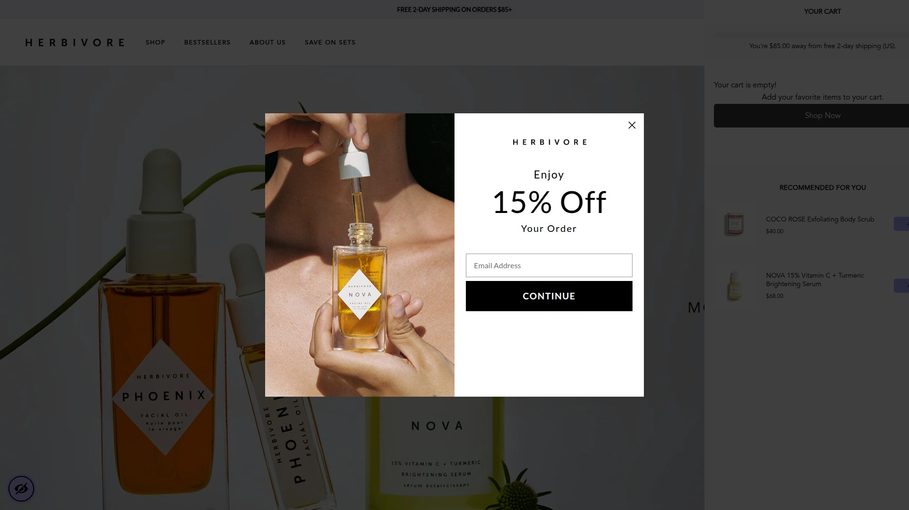

Herbivore Botanicals creates skincare, body care, and lifestyle products as gentle on planet as on your body. All formulations use clean natural ingredients never tested on animals. Glass and paper packaging eliminates plastic waste while looking beautiful on bathroom shelves. The brand avoids dyes, synthetic fragrances, and parabens ensuring maximum biocompatibility with human skin.

The product line focuses on gentle efficacy rather than aggressive treatments—Herbivore recognizes that healthy skin doesn't require harsh intervention. This philosophy particularly appeals to sensitive skin types who've experienced irritation from conventional products loaded with synthetic actives. Natural botanical extracts work synergistically providing cumulative benefits over time rather than dramatic overnight transformation.

**Aromatherapy integration sets Herbivore apart:** Essential oil blends provide therapeutic benefits beyond skincare through aromatherapy during application. Herbivore Aromatherapy Oil Rollers offer portable stress relief combining skincare with mood enhancement. After stressful weeks, users unwind with these rollers plus relaxing baths creating complete self-care rituals.

Herbivore Botanicals appears consistently on lists comparing clean beauty brands similar to Drunk Elephant, indicating parallel quality standards and consumer trust. The brand successfully balances efficacy with gentleness—products deliver results without irritation common in aggressive conventional treatments. Cruelty-free vegan status combined with natural ingredients appeals to ethically-conscious consumers refusing to compromise values for beauty.

The brand's aesthetic presentation through minimalist glass packaging elevates daily skincare routines into luxurious self-care experiences. This attention to complete user experience distinguishes Herbivore from purely functional skincare brands. For consumers seeking gentle botanical skincare with aromatherapy benefits, Herbivore Botanicals provides holistic approach to beauty.

## **[OSEA](https://oseamalibu.com)**

Seaweed-infused vegan skincare powered by ocean ingredients and renewable energy.

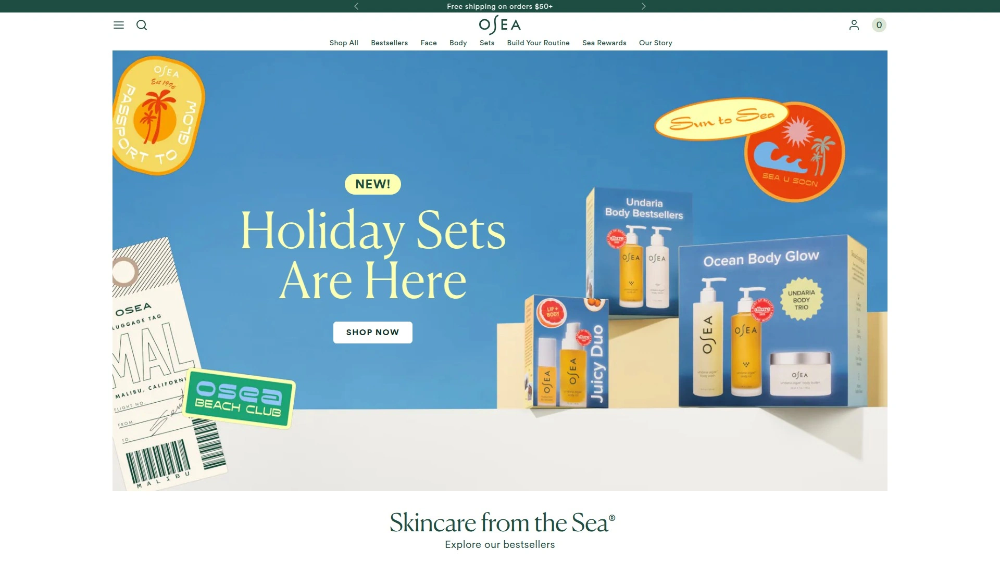

OSEA pioneered seaweed-based skincare 29 years ago creating safe collection healthy for bodies and earth. Hand-harvested sustainably sourced seaweed provides foundation for product line. Pure cold-pressed essential oils combined with seaweed create nourishing one-of-a-kind formulations. Climate Neutral Certification, renewable energy operations, and glass recyclable packaging demonstrate environmental commitment.

Ocean Cleanser exemplifies marine ingredient approach—seaweed and minerals remove impurities while infusing skin with moisture and radiance. Follow with Hyaluronic Sea Serum, Seabiotic Water Cream, and Essential Hydrating Oil keeping precious moisture where it belongs. This complete routine harnesses ocean power for comprehensive skincare regimen.

**Seaweed science explained:** Seaweed contains vitamins, minerals, and amino acids in concentrations beneficial for human skin. Ocean plants survive harsh marine environments developing protective compounds humans can harness for skincare benefits. OSEA's sustainable harvesting ensures ocean ecosystems remain healthy while providing ingredients.

Product line includes cleansers, toning mists, serums, moisturizers, and renewing masks addressing complete skincare needs. High-performance ingredients like seaweed, hyaluronic acid, and vitamin C deliver visible glow rather than just surface-level hydration. The brand's custom routine quiz helps customers identify optimal products for specific skin types and concerns.

OSEA maintains vegan cruelty-free sustainable standards throughout operations. Users describe products keeping skin clear, soft, and hydrated without additives or synthetic fragrances. The ocean-based ingredient philosophy provides unique alternative to conventional botanical or chemical skincare. For clean beauty enthusiasts wanting marine-powered solutions, OSEA's seaweed expertise delivers time-tested results.

## **[Tata Harper](https://tataharperskincare.com)**

Luxury farm-to-face skincare manufacturing everything in-house from Vermont farm ingredients.

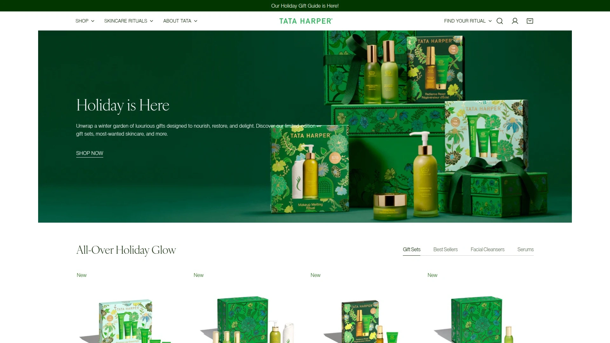

Tata Harper built brand on essential idea that people no longer sacrifice health to look beautiful. Handmade in Vermont using naturally derived nontoxic ingredients, products employ world's most advanced results-driven technology nourishing skin while fighting aging signs. This combination of natural ingredients with sophisticated processing delivers luxury-level results without synthetic chemicals.

The farm-to-face approach means Tata Harper sources over 300 organic ingredients from 68+ countries prioritizing quality over quantity. No mass-produced components enter formulas. Complete manufacturing happens in-house on their Vermont farm maintaining unparalleled quality control and transparency. This vertical integration ensures ingredient integrity from harvest through final packaging.

**Premium product highlights:** Regenerating Cleanser starts routines with gentle yet effective cleansing. Resurfacing Mask provides at-home treatment comparable to professional facials. Retinoic Nutrient Face Oil delivers retinol benefits through natural plant-derived alternatives. SUPERKIND Fortifying Moisturizer specifically addresses sensitive reactive skin with hypoallergenic dermatologist-tested fragrance-free formula.

Tata Harper adheres to Credo Clean Standard meaning products are free from 2,700+ potentially harmful ingredients commonly found in beauty products. This rigorous standard exceeds FDA requirements and most competitor clean beauty claims. Formulas prioritize long-term skin health over quick fixes that damage skin barrier requiring escalating product usage.

The brand's "beauty without compromise" philosophy centers on delivering visible results while prioritizing skin health. High-performance natural skincare proves effective treatment doesn't require synthetic chemicals. Tata Harper represents premium tier of clean beauty where luxury experience meets uncompromising ingredient standards. For consumers willing to invest in farm-fresh luxury skincare, Tata Harper's Vermont-made products justify premium pricing.

## **[Beautycounter](https://www.beautycounter.com)**

Advocacy-driven clean beauty brand championing safer industry standards through rigorous ingredient screening.

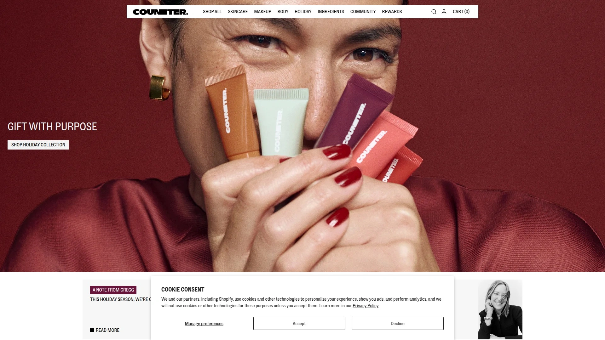

Beautycounter distinguishes itself through active advocacy for safer beauty standards beyond just formulating clean products. The brand lobbies for stronger cosmetic regulations and increased FDA oversight of beauty industry. This activist approach addresses systemic problems allowing dangerous ingredients in consumer products. Beautycounter believes changing industry requires both offering clean alternatives and fighting for better laws.

Rigorous ingredient selection process ensures products meet safety and effectiveness standards. The brand's "Never List" bans 2,800+ questionable ingredients from all formulations—more restrictive than most clean beauty competitors. This extreme caution prioritizes consumer safety even when specific ingredients lack definitive harm studies.

**Complete beauty ecosystem:** Beautycounter produces skincare, makeup, body care, and sun protection covering every beauty need through clean formulations. This comprehensive approach lets customers replace entire conventional routine with safer alternatives rather than mixing clean and conventional products. The brand maintains consistent quality across categories unlike competitors excelling in skincare but offering mediocre makeup.

Beautycounter's transparency extends to supply chain disclosures and ingredient sourcing details. Customers can trace ingredients from origin through final product understanding exactly what they're applying to skin. This radical transparency builds trust in industry notorious for proprietary formulas hiding questionable ingredients.

The brand's activism resonates with consumers wanting their purchases supporting larger positive change beyond individual product benefits. Beautycounter's lobbying efforts have influenced actual legislation protecting consumers from harmful ingredients. For clean beauty consumers prioritizing advocacy alongside personal skincare needs, Beautycounter channels purchases toward systemic industry improvement.

## **[Ilia Beauty](https://iliabeauty.com)**

Clean makeup and skincare formulated with organic ingredients in recyclable sustainable packaging.

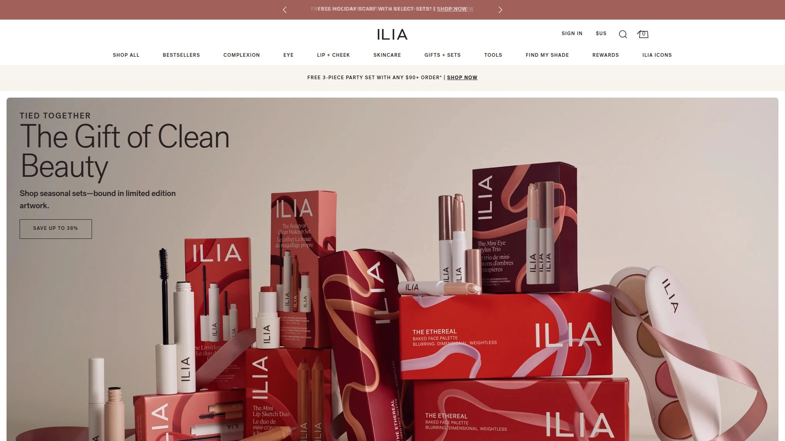

Ilia Beauty offers clean cruelty-free makeup range including lipsticks, foundations, and highlighters. Products formulate using organic ingredients packaged in recyclable materials reducing environmental impact. The brand bridges gap between conventional makeup performance and clean beauty principles proving color cosmetics don't require synthetic ingredients for lasting wear.

Ilia's makeup line delivers pigmentation, longevity, and blendability matching conventional brands while maintaining clean ingredient standards. This performance parity matters since early clean makeup earned reputation for poor color payoff and short wear time. Ilia proved clean formulations could compete with conventional products changing perceptions about natural makeup capabilities.

**Skincare meets makeup innovation:** Ilia products incorporate skincare ingredients into makeup formulas providing treatment benefits during wear. Foundations contain hyaluronic acid and vitamin E nourishing skin rather than merely covering imperfections. Lipsticks include moisturizing plant oils preventing the dryness common in long-wear formulas.

Sustainable packaging using recyclable materials demonstrates environmental commitment beyond ingredient selection. The brand recognizes complete clean beauty addresses packaging waste and manufacturing processes not just formula safety. Ilia's recyclable compacts and sustainable sourcing practices minimize environmental footprint across product lifecycle.

Clean makeup consumers appreciate Ilia's balance between performance, ingredient safety, and environmental sustainability. The brand appears frequently on clean beauty recommendation lists alongside skincare specialists proving expertise extends beyond single product category. For makeup enthusiasts refusing to compromise between clean ingredients and professional-quality performance, Ilia Beauty delivers both.

## **[RMS Beauty](https://www.rmsbeauty.com)**

Luxurious clean makeup created using raw organic food-grade ingredients nourishing skin.

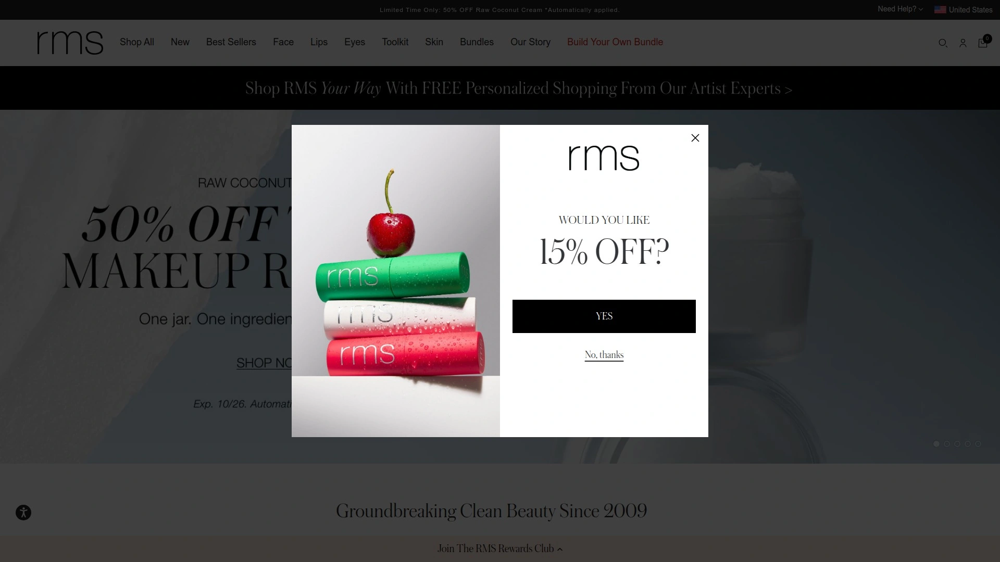

RMS Beauty pioneered raw organic makeup using food-grade ingredients safe enough to eat. Founder Rose-Marie Swift developed products after experiencing health issues she attributed to toxic makeup exposure during modeling career. This personal motivation drives brand's commitment to absolute ingredient purity.

Raw organic ingredients maintain full nutritional profiles since minimal processing preserves vitamins, antioxidants, and beneficial compounds. Conventional cosmetics undergo heavy processing degrading ingredient quality. RMS's minimal processing approach means makeup simultaneously beautifies and nourishes skin.

**Coconut oil foundation transforms makeup paradigm:** RMS formulas use coconut oil as primary base rather than synthetic emulsifiers and silicones. Coconut oil provides moisturization, antimicrobial benefits, and smooth application without petroleum-derived ingredients. This natural base creates makeup that improves skin condition over time rather than causing breakouts and irritation.

The brand's emphasis on multi-use products reduces consumption and simplifies routines. Single products function as lip color, cheek tint, and eye shadow eliminating need for separate items. This minimalist approach aligns with sustainable beauty principles reducing packaging waste and encouraging mindful consumption.

RMS Beauty's luxury positioning demonstrates clean makeup belongs in high-end beauty category not just budget natural alternatives. The brand's organic ingredients and minimal processing justify premium pricing for discerning consumers prioritizing ingredient purity. For makeup purists wanting food-grade beauty products, RMS Beauty's raw organic approach represents cleanest possible option.

## FAQ

**Do frozen facial treatments actually work better than regular face masks?**

Yes—cryotherapy constricts blood vessels reducing inflammation and puffiness while tightening pores instantly. Cold temperatures help active ingredients penetrate deeper into skin compared to room-temperature application. The ice therapy stimulates blood circulation bringing oxygen and nutrients to skin surface for healthy glow. Studies show combining cold therapy with beneficial ingredients like those in Love & Pebble's Beauty Pops delivers superior results compared to standalone treatments. Ice rollers from Skin Gym and BeautyBio provide similar benefits through reusable tools rather than single-use masks.

**Are clean beauty products actually safer than conventional skincare or just marketing hype?**

Clean beauty brands like Drunk Elephant, Tata Harper, and Beautycounter ban 2,700-2,800 potentially harmful ingredients that remain legal in conventional products. These include parabens, phthalates, synthetic fragrances, and hormone disruptors linked to health concerns in peer-reviewed studies. While FDA regulates cosmetics minimally, clean beauty companies self-impose stricter standards prioritizing long-term safety over short-term results. Third-party certifications like EWG Verified, MADE SAFE, and Leaping Bunny provide independent verification of safety claims. However, "clean" remains unregulated term so research specific brand standards rather than accepting marketing at face value.

**How do you know which clean beauty brands actually deliver results versus just being natural?**

Look for brands combining clean ingredients with clinical testing and transparent efficacy studies. Tata Harper, Drunk Elephant, and Youth To The People publish ingredient concentrations and clinical results demonstrating measurable improvements. Read detailed customer reviews focusing on long-term results rather than immediate impressions—effective products show cumulative benefits over 4-8 weeks. Brands with pharmacy or dermatologist founders like Love & Pebble bring scientific credentials to formulation. Avoid products making exaggerated claims like "erases wrinkles overnight" since even prescription treatments require consistent use for visible results.

## Conclusion

The clean beauty revolution proves you don't need to choose between effective skincare and ingredient safety—innovative brands deliver professional results through plant-powered formulas and cryotherapy without questionable chemicals. Whether you prioritize frozen facial treatments combining superfoods with ice therapy, professional-grade cryo tools for daily de-puffing, or comprehensive clean beauty routines from farm-to-face luxury brands, these platforms transform skincare into self-care ritual supporting long-term skin health. The best clean beauty companies maintain transparency about sourcing, manufacturing, and ingredient selection while advocating for stronger industry regulations protecting all consumers. [Love & Pebble](https://loveandpebble.com) excels for innovative beauty enthusiasts wanting frozen facial treatments that merge proven cryotherapy benefits with superfood nutrition through mess-free Beauty Pops application—the pharmacy-backed formulas deliver instant glow, reduced inflammation, and clearer skin using only plant-powered ingredients you can actually pronounce. For anyone tired of conventional skincare's questionable ingredient lists and ready to experience how frozen superfoods revolutionize at-home facials, Love & Pebble's viral Beauty Pops provide the perfect entry into clean cryotherapy skincare.
